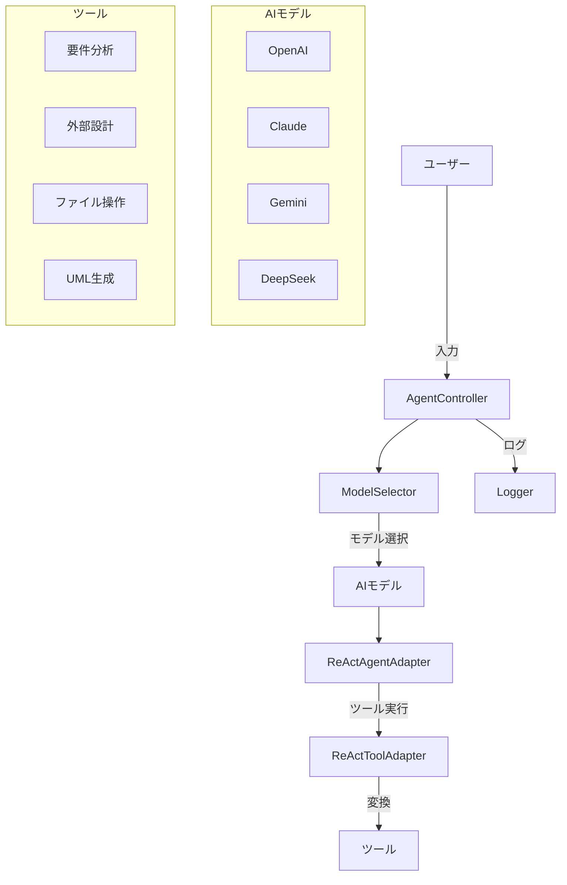
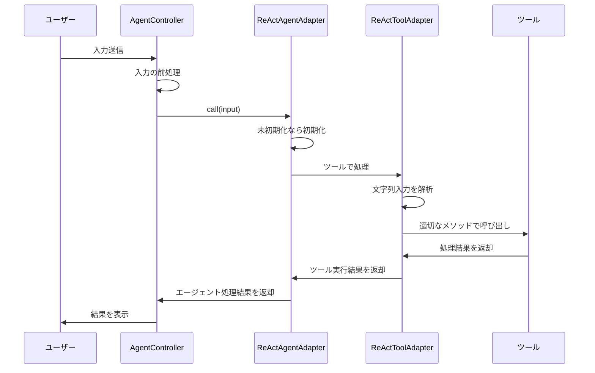
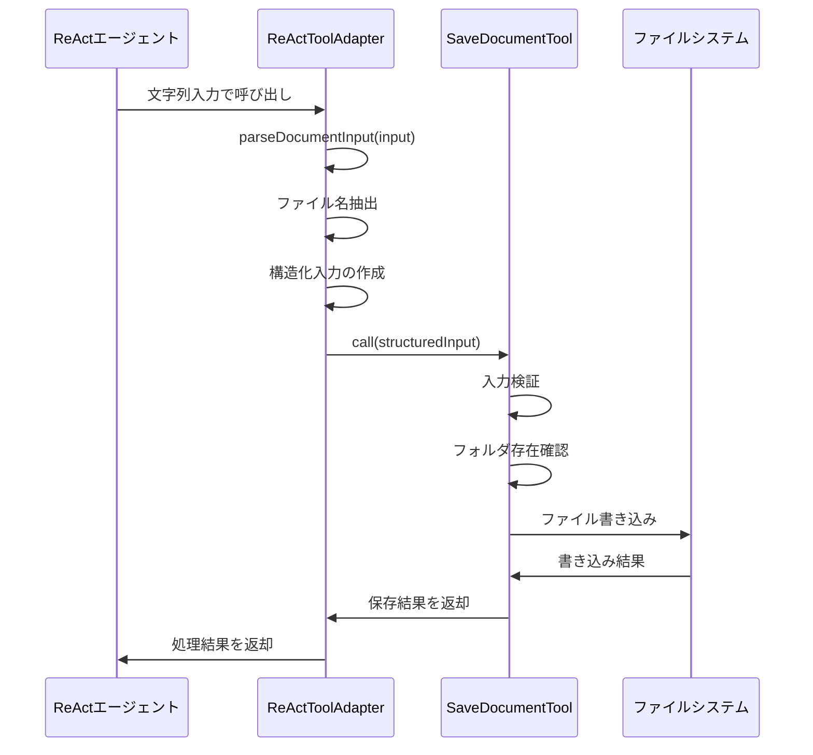

# ReAct技術を使用したLangChain v0.3エージェント - 外部設計

## 1. システム概要

本システムは、LangChain v0.3フレームワークを使用してReAct（Reasoning and Acting）技術を実装したAIエージェントシステムです。複数のAIモデル（OpenAI, Claude, Gemini, DeepSeek）に対応し、要件分析や外部設計などのソフトウェア開発プロセスをサポートします。

### 1.1 アーキテクチャ概要

システム全体は以下の主要コンポーネントで構成されます：

1. **AgentController**: エージェントの実行と管理を担当
2. **ModelSelector**: 複数のAIモデル間の切り替えを管理
3. **ToolProvider**: 各種ツールの提供と管理
4. **Logger**: 多層的なログ機能の提供
5. **ReActAgentAdapter**: LangChain v0.3のReActエージェントの適応
6. **ReActToolAdapter**: ツール入力の変換と処理



## 2. モジュール構成

### 2.1 ディレクトリ構造

```
FifthStudy/
│
├── src/                    # ソースコード
│   ├── index.js            # エントリーポイント
│   ├── agent-controller.js # エージェントコントローラー
│   ├── agents/             # エージェント関連
│   │   ├── react-agent.js  # ReActエージェント（旧）
│   │   └── react-agent-adapter.js # ReActエージェントアダプター（v0.3対応）
│   ├── models/             # モデル関連
│   │   ├── selector.js     # モデルセレクタ
│   │   ├── openai.js       # OpenAIモデル
│   │   ├── claude.js       # Claudeモデル
│   │   ├── gemini.js       # Geminiモデル
│   │   └── deepseek.js     # DeepSeekモデル
│   ├── tools/              # ツール関連
│   │   ├── analysis-tools.js # 分析ツール
│   │   ├── file-tools.js   # ファイル操作ツール
│   │   ├── diagram-tools.js # ダイアグラム生成ツール
│   │   └── react-tool-adapter.js # ツールアダプター
│   └── utils/              # ユーティリティ
│       ├── logger.js       # ロガー
│       └── formatter.js    # フォーマッター
│
├── doc/                    # ドキュメント
├── test/                   # テストコード
└── output/                 # 出力ファイル保存先
```

### 2.2 主要モジュールの責務

| モジュール名 | 主な責務 |
|------------|---------|
| AgentController | ユーザー入力の処理、エージェントの実行制御、モデル選択の連携 |
| ModelSelector | 適切なAIモデルの選択、モデル情報の管理 |
| ReActAgentAdapter | LangChain v0.3のReActエージェント適応、ツールラッピング、Hub連携 |
| ReActToolAdapter | 文字列入力のJSON変換、ツール固有の処理 |
| ToolProvider | 各種ツールの提供と管理 |
| Logger | アプリケーション、HTTP、チャットログの記録 |

## 3. クラス設計

### 3.1 AgentController

エージェントの実行と管理を担当するコントローラークラス。

```javascript
class AgentController {
    constructor(config = {}) {
        this.tools = [];             // 利用可能なツール
        this.model = null;           // 現在のモデル
        this.agent = null;           // ReActエージェント
        this.initialized = false;    // 初期化状態
        this.sessions = [];          // セッション履歴
    }
    
    async initialize() {
        // モデルとツールの初期化
        // ReActAgentAdapterの作成
    }
    
    async changeModel(modelName) {
        // 使用するAIモデルの切り替え
    }
    
    async runAgent(userInput) {
        // エージェントの実行
        // 結果のフォーマットと返却
    }
    
    getStatus() {
        // 現在の状態を返却
    }
}
```

### 3.2 ModelSelector

複数のAIモデル間の切り替えを管理するクラス。

```javascript
class ModelSelector {
    constructor() {
        this.models = {};        // 利用可能なモデル
        this.currentModel = "";  // 現在のモデル名
    }
    
    initializeModels() {
        // 各モデルの初期化
    }
    
    getModel(modelName) {
        // モデル名からモデルを取得
    }
    
    listAvailableModels() {
        // 利用可能なモデル一覧を返却
    }
}
```

### 3.3 ReActAgentAdapter

LangChain v0.3のReActエージェントを適応するアダプタークラス。

```javascript
class ReActAgentAdapter {
    constructor(config) {
        this.config = config;        // 設定情報
        this.tools = config.tools;   // 利用可能なツール
        this.model = config.model;   // 使用するモデル
        this.agent = null;           // ReActエージェント
        this.executor = null;        // エージェント実行チェーン
    }
    
    async initialize() {
        // Hubからプロンプトを取得
        // ツールをReActToolAdapterでラップ
        // ReActエージェントと実行チェーンの作成
    }
    
    async call(input) {
        // エージェントの実行
        // 結果の返却
    }
}
```

### 3.4 ReActToolAdapter

ツール入力の変換と処理を担当するアダプタークラス。

```javascript
class ReActToolAdapter {
    constructor(originalTool) {
        this.originalTool = originalTool;  // 元のツール
        this.name = originalTool.name;     // ツール名
        this.description = originalTool.description;  // 説明
        this.schema = originalTool.schema;  // スキーマ
    }
    
    async invoke(input) {
        // 文字列入力の解析とJSON変換
        // ツール固有の入力処理
        // 元のツールの呼び出し
    }
    
    async callOriginalTool(structuredInput) {
        // 適切なメソッド（call/_call）を選んで呼び出し
    }
    
    parseInput(input) {
        // ツール固有の入力解析ロジック
    }
}
```

### 3.5 SaveDocumentTool

ドキュメントを保存するためのツール。

```javascript
class SaveDocumentTool extends StructuredTool {
    constructor() {
        super();
        this.name = "save_document";
        this.description = "生成したドキュメントをファイルに保存します";
        this.schema = z.object({
            fileName: z.string().describe("保存するファイル名"),
            content: z.string().describe("保存するコンテンツ"),
            folder: z.string().optional().describe("保存フォルダ（デフォルトは 'output'）"),
            overwrite: z.boolean().optional().describe("既存ファイルの上書き（デフォルトは true）")
        });
    }
    
    async _call(input) {
        // ファイル保存処理
        // UTF-8エンコーディングの明示的指定
        // エラーハンドリング
    }
}
```

## 4. シーケンス

### 4.1 エージェント実行シーケンス



### 4.2 SaveDocumentTool実行シーケンス



## 5. ユーザーインターフェース

### 5.1 コマンドラインインターフェース

```
Usage: node index.js [options] [command]

Options:
  -m, --model <name>    使用するモデル名を指定 (default: "gpt-3.5-turbo")
  -v, --verbose         詳細なログ出力を有効化
  -h, --help            ヘルプ情報を表示

Commands:
  analyze <input>       要件分析を実行
  design <input>        外部設計を実行
  interactive           対話モードを開始
  test                  テストを実行
```

### 5.2 対話モード

```
=== ReAct Agent ===
使用モデル: gpt-3.5-turbo
利用可能コマンド:
  .model <name>  - モデルを変更
  .status        - 現在の状態を表示
  .tools         - 利用可能なツールを表示
  .help          - ヘルプを表示
  .exit          - 終了

> // ユーザー入力
```

## 6. 保守機能

### 6.1 ログ機能

3つのレベルでログを記録します：

1. **アプリケーションログ**：
   - 情報（INFO）、警告（WARN）、エラー（ERROR）レベル
   - ファイル出力とコンソール出力
   - 日付ごとのローテーション

2. **HTTP通信ログ**：
   - AIモデルとの通信内容
   - リクエスト/レスポンスの詳細
   - ネットワークエラーの記録

3. **チャットログ**：
   - ユーザー入力と応答
   - ツール実行のトレース
   - エージェントの思考プロセス

### 6.2 テスト機能

以下のテストを実装します：

1. **ユニットテスト**：
   - 各モジュールの機能テスト
   - エラー処理のテスト

2. **統合テスト**：
   - エージェント実行の検証
   - モデル切り替えの検証
   - ツール実行の検証

3. **特殊テスト**：
   - SaveDocumentToolのテスト
   - ReActToolAdapterのテスト
   - ReActAgentAdapterのテスト

## 7. 制約と非機能要件

### 7.1 パフォーマンス

- AIモデル応答時間：5秒以内（ネットワーク遅延を除く）
- メモリ使用量：最大500MB
- 同時実行：最大5セッション

### 7.2 セキュリティ

- APIキーの環境変数からの読み込み
- センシティブ情報のログ出力抑制
- 入力データのバリデーション

### 7.3 保守性

- モジュール化されたコード構成
- 詳細なコメントとドキュメント
- 拡張可能なプラグイン構造

## 8. LangChain v0.3対応

### 8.1 主な変更点

| 項目 | v0.2 | v0.3 | 対応方針 |
|-----|-----|-----|---------|
| ReActエージェント初期化 | シンプルな初期化 | 必須変数の指定が必要 | Hubからプロンプトを取得 |
| ツール呼び出しメソッド | `invoke` | `call`/`_call` | メソッド動的選択 |
| ツール入力形式 | JSON | 文字列 | アダプターでJSON変換 |
| プロンプト管理 | ローカル | Hub連携 | Hubからプロンプト取得 |

### 8.2 ReActAgentAdapter設計

**目的**：
- LangChain v0.3のReActエージェントを既存システムに適応する
- 既存コードの変更を最小限に抑える
- 堅牢なエラーハンドリングを提供する

**主要機能**：
1. HubからReActプロンプトの取得
2. ツールのReActToolAdapterでのラッピング
3. 適切なエージェント実行チェーンの構築
4. エラー処理と結果の整形

### 8.3 ReActToolAdapter設計

**目的**：
- 文字列入力からJSON形式への変換
- ツール固有の入力処理の実装
- 適切なツールメソッドの動的選択

**主要機能**：
1. 文字列入力の解析とJSON変換
2. ツール固有の特殊処理（SaveDocumentTool等）
3. 適切なツールメソッド（call/_call）の選択と実行
4. エラーハンドリングと結果整形

### 8.4 SaveDocumentTool修正

**目的**：
- LangChain v0.3との互換性確保
- ファイル名抽出ロジックの強化
- エラーハンドリングの改善

**主要変更点**：
1. `invoke`メソッドから`call`/`_call`メソッドへの移行
2. コンテンツからのファイル名抽出ロジックの改善
3. UTF-8エンコーディングの明示的指定
4. 堅牢なエラーハンドリングの追加

## 9. 今後の拡張計画

1. WebインターフェースのUI実装
2. プラグイン形式でのツール追加機能
3. チャット履歴の永続化
4. より高度なエージェント戦略の実装
5. ユーザーフィードバックの収集と分析機能

最終更新日: 2025年3月1日 